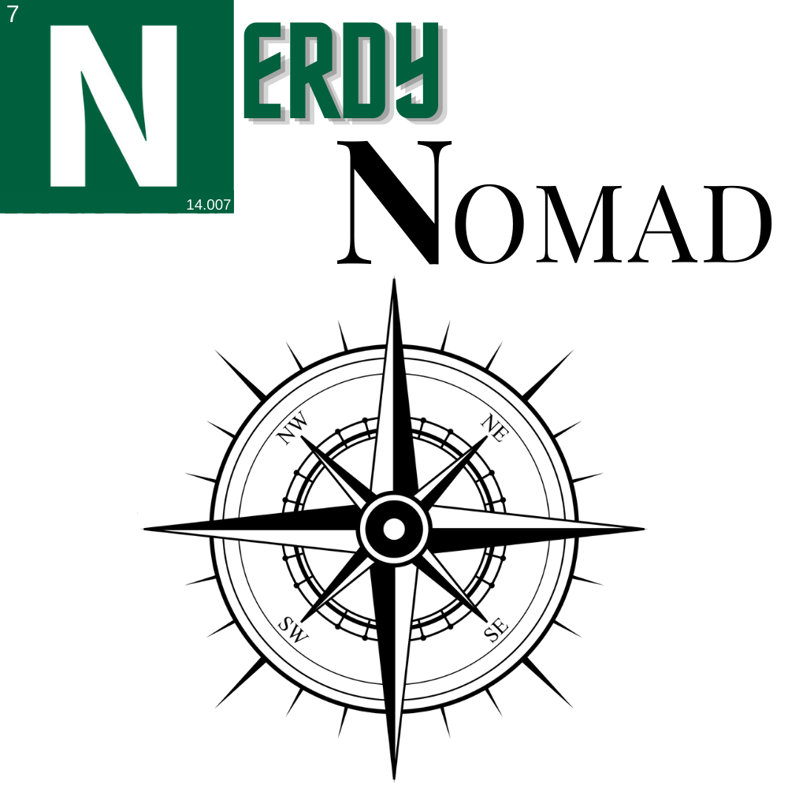
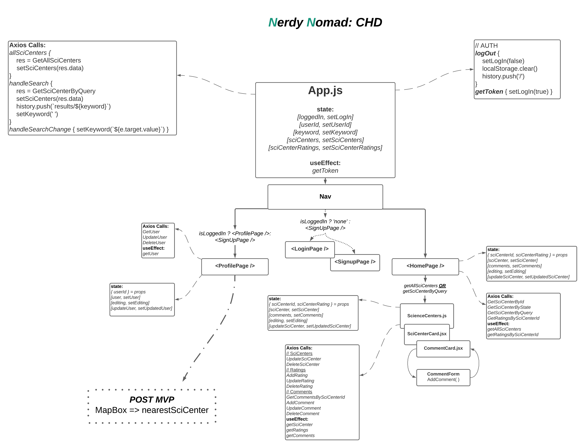
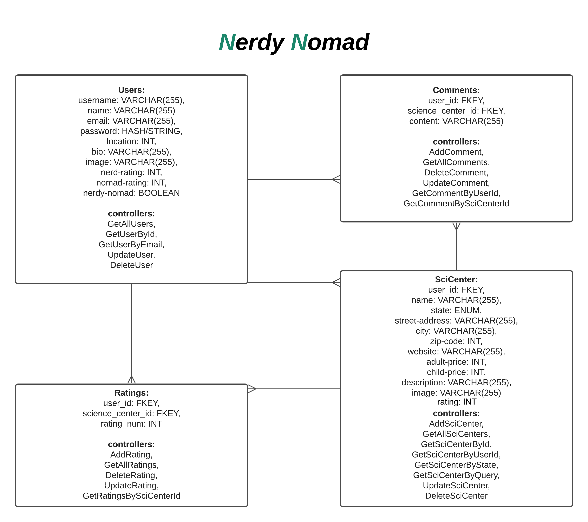
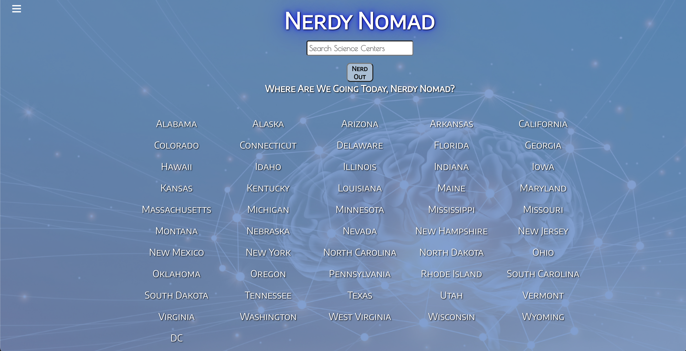
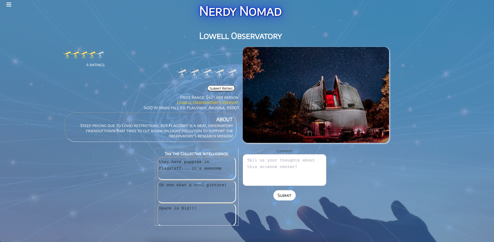
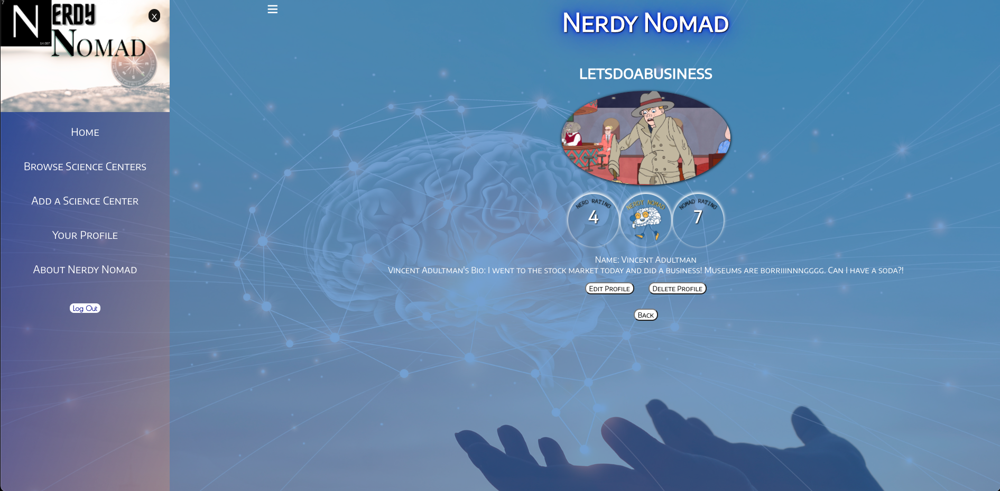

# Nerdy Nomad
## Created & Coded By Bailey Leavitt
## July 2021

### Connect with the Creator
[Bailey's LinkedIn](https://www.linkedin.com/in/baileyleavitt/)

### Behind the Scenes of Fullstack App Development
[Trello Board for Project](https://trello.com/b/WNPlxFUJ/nerdy-nomad)
***

## Description
**Nerdy Nomad** is a resource app helping Users connect with a science center in all 50 United States (and DC). Users can create profiles--secured by Authentication--then comment and rate science centers they have visited. Users get a Nerd Rating based on the number of science centers they've visited, and a Nomad Rating based on the number of states they've visited. If their Nerd and Nomad ratings are sufficiently high, Users can earn the *Nerdy Nomad* badge and display it on their profile!

***

## Tech Used
**PERN Stack**: PostreSQL | Express | React.js | Node.js | JavaScript (ES6) | HTML5 | CSS3

***

## Getting Started
Users can enjoy Nerdy Nomad without ever logging in or creating an account, but all interactive portions of the site are blocked using conditional rendering. Once the user signs up or signs in, they get the full enjoyment of adding science centers to the database, personalizing their profiles, commenting on science centers, and rating science centers! The side nav bar on the site makes navigation across pages easy, and most pages are equipped with back buttons to return the user to the home page (for those who don't want to use the back button in the browser).

***

## Game Design

***

## Screenshots from Nerdy Nomad

***

## Frontend Requirements
- [X] Home/Landing page
- [X] Nav bar
- [X] Sign up form
- [X] Login form
- [X] User profile
- [X] Science center posts
- [X] Comments on science center components
- [X] Ratings on science center components
- [X] React Rainbow

## Backend Requirements
- [X] User Authentication
- [X] POST - 'Create' user profile
- [X] POST - 'Create' science center
- [X] POST - 'Create' comment
- [X] POST - 'Create' rating
- [X] GET - 'Read' all science centers
- [X] GET - 'Read' searched science centers
- [X] GET - 'Read' science centers by state
- [X] GET - 'Read' science centers by user id
- [X] GET - 'Read' comments on a science center page
- [X] PUT - 'Update' science center
- [X] PUT - 'Update' user profile
- [X] PUT - 'Update' comment
- [X] DELETE - 'Delete' science center
- [X] DELETE - 'Delete' user profile
- [X] DELETE - 'Delete' comment

***

## Post-MVP Additions
- Implement external API (MapBox) to show users the nearest science center to them
- See Trello Board for full list!

***

## Credits
- `LucidChart`: [CHD & ERD](https://lucid.app/)
- `Canva`: [Graphic Design for Logos, Default Images, and Rating Images](https://www.canva.com/)
- `React Rainbow`: [Mostly for Forms - but NOT Ratings - just for Hunter](https://react-rainbow.io/)